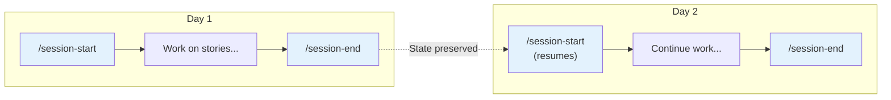
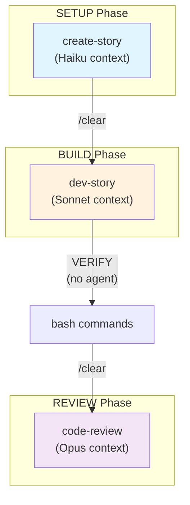
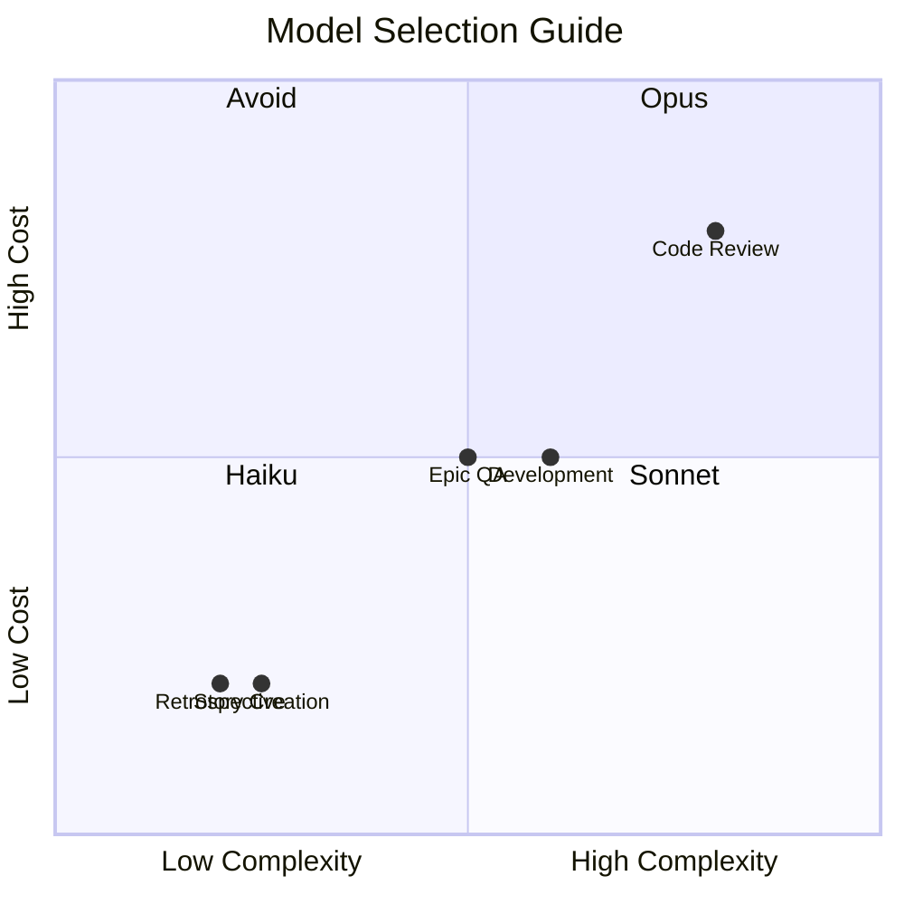
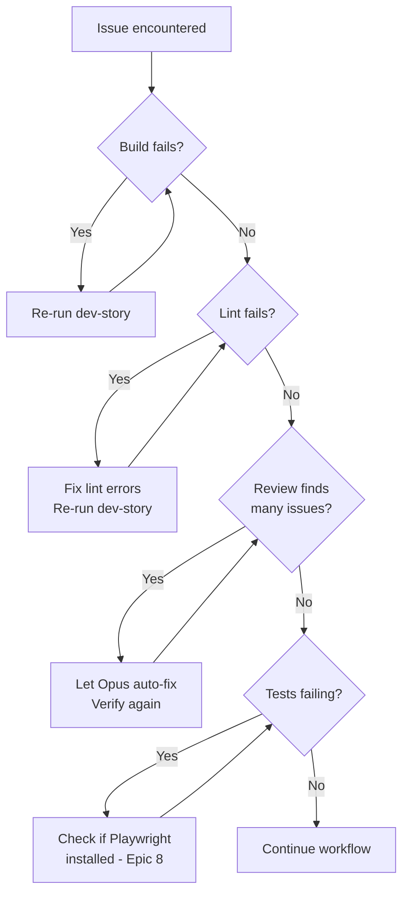

# CoopReady Development Workflow

> **Version:** 2.0.0
> **Last Updated:** 2026-01-20
> **Author:** Lawrence + Claude
> **BMAD Version:** 6.0.0-alpha.23

A streamlined, quality-focused development workflow for implementing stories using BMAD methodology with epic-level QA validation.

---

## Table of Contents

1. [Quick Reference](#quick-reference)
2. [Workflow Overview](#workflow-overview)
3. [Session Management](#session-management)
4. [Per-Story Workflow](#per-story-workflow)
   - [Phase 1: SETUP](#phase-1-setup)
   - [Phase 2: BUILD](#phase-2-build)
   - [Phase 3: VERIFY](#phase-3-verify)
   - [Phase 4: REVIEW](#phase-4-review)
   - [Phase 5: SHIP](#phase-5-ship)
5. [Epic Completion](#epic-completion)
   - [Epic QA Validation](#epic-qa-validation)
   - [Epic Retrospective](#epic-retrospective)
6. [Context Management](#context-management)
7. [Model Selection](#model-selection)
8. [Troubleshooting](#troubleshooting)

---

## Quick Reference

```bash
# ══════════════════════════════════════════════════════════════════════
# COOPREADY DEVELOPMENT WORKFLOW - COMMAND CHEAT SHEET
# ══════════════════════════════════════════════════════════════════════

# SESSION START (beginning of work session)
/session-start

# ──────────────────────────────────────────────────────────────────────
# PER-STORY WORKFLOW (repeat for each story)
# ──────────────────────────────────────────────────────────────────────

# SETUP
git checkout main && git pull
git checkout -b feat/{{story-key}}
/bmad:bmm:workflows:create-story --model haiku

# BUILD
/clear
/bmad:bmm:workflows:dev-story

# VERIFY
npm run build && npm run lint

# REVIEW (only if VERIFY passes)
/clear
/bmad:bmm:workflows:code-review --model opus

# SHIP
git push -u origin feat/{{story-key}}
gh pr create --fill && gh pr merge --squash --delete-branch
git checkout main && git pull

# ──────────────────────────────────────────────────────────────────────
# EPIC COMPLETION (once, after all stories in epic are done)
# ──────────────────────────────────────────────────────────────────────

# QA VALIDATION
/clear
/bmad:bmm:agents:tea
# Commands: TR (trace) → TA (automate if needed)

# RETROSPECTIVE (optional)
/clear
/bmad:bmm:workflows:retrospective

# ──────────────────────────────────────────────────────────────────────

# SESSION END (before ending work session)
/session-end

# ══════════════════════════════════════════════════════════════════════
```

---

## Workflow Overview

### Philosophy

- **Simplicity first** - Minimal phases, clear actions
- **Quality via gates** - Verify before expensive reviews
- **Efficient QA** - Epic-level validation, not per-story
- **Context awareness** - Clear when needed, preserve when valuable

### Visual Flow

```mermaid
flowchart TB
    subgraph SESSION ["Work Session"]
        START["/session-start"]

        subgraph EPIC ["Epic N"]
            subgraph STORY1 ["Story N.1"]
                S1[SETUP<br/>Haiku] --> B1[BUILD<br/>Sonnet] --> V1[VERIFY<br/>bash] --> R1[REVIEW<br/>Opus] --> SH1[SHIP<br/>git]
            end

            subgraph STORY2 ["Story N.2"]
                S2[SETUP] --> B2[BUILD] --> V2[VERIFY] --> R2[REVIEW] --> SH2[SHIP]
            end

            subgraph STORY3 ["Story N.3"]
                S3[SETUP] --> B3[BUILD] --> V3[VERIFY] --> R3[REVIEW] --> SH3[SHIP]
            end

            SH1 --> S2
            SH2 --> S3
            SH3 --> QA[Epic QA<br/>TEA]
            QA --> RETRO[Retrospective<br/>optional]
        end

        RETRO --> END["/session-end"]
    end

    START --> S1

    style START fill:#e3f2fd
    style END fill:#e3f2fd
    style QA fill:#e8f5e9
    style RETRO fill:#fff3e0
```



### Phase Summary

| Phase | Purpose | Model | Tokens |
|-------|---------|-------|--------|
| **SETUP** | Branch + story creation | Haiku | Low |
| **BUILD** | Implementation + tests | Sonnet | Medium |
| **VERIFY** | Pre-flight check | None | Zero |
| **REVIEW** | Quality assurance | Opus | Medium-High |
| **SHIP** | PR + merge | None | Zero |
| **Epic QA** | Coverage validation | Sonnet (TEA) | Medium |
| **Retrospective** | Lessons learned | Any | Low |

---

## Session Management

### What Are Sessions?

Sessions preserve your work state between terminal sessions. When you close Claude Code and return later, session management helps you resume where you left off.

### Starting a Session

**When:** At the beginning of each work session (when you open Claude Code to start working)

```bash
/session-start
```

**What it does:**
- Loads previous session state
- Shows where you left off
- Restores context about in-progress work

**Example output:**
```
Resuming session from 2026-01-20 14:30
Last activity: Story 3-5 BUILD phase complete
Next step: Run VERIFY phase
```

### Ending a Session

**When:** Before closing Claude Code or taking a significant break

```bash
/session-end
```

**What it does:**
- Saves current session state
- Records what you were working on
- Notes next steps for resumption

**Example output:**
```
Session saved.
Current state: Story 3-5 in REVIEW phase
Sprint progress: Epic 3 - 4/6 stories complete
```

### Session Flow



### When to Use Session Commands

| Scenario | Action |
|----------|--------|
| Starting work for the day | `/session-start` |
| Taking lunch break (< 1 hour) | No action needed |
| Done for the day | `/session-end` |
| Switching to different project | `/session-end` |
| Returning after break (> 1 hour) | `/session-start` |
| Terminal crashed | `/session-start` on restart |

---

## Per-Story Workflow

### Phase 1: SETUP

**Purpose:** Create branch and generate story file with full context.

**Model:** Haiku (cost-efficient for template filling)

#### Steps

1. **Ensure you're on latest main:**
   ```bash
   git checkout main && git pull
   ```

2. **Identify next story from sprint-status:**
   ```bash
   grep "ready-for-dev\|backlog" _bmad-output/implementation-artifacts/sprint-status.yaml | head -5
   ```

3. **Create feature branch:**
   ```bash
   git checkout -b feat/{{story-key}}
   ```

   Example: `git checkout -b feat/3-5-job-description-input`

4. **Generate story file:**
   ```bash
   /bmad:bmm:workflows:create-story --model haiku
   ```

5. **Wait for completion.** Verify:
   - Story file created in `_bmad-output/implementation-artifacts/`
   - Status shows `ready-for-dev`
   - Dev Notes section is populated

#### Gate Checklist

- [ ] On feature branch (not main)
- [ ] Story file exists with status `ready-for-dev`
- [ ] Dev Notes contain implementation guidance
- [ ] Branch name matches story key

---

### Phase 2: BUILD

**Purpose:** Implement all story tasks with tests using TDD approach.

**Model:** Sonnet (standard implementation)

#### Steps

1. **Clear context for fresh start:**
   ```bash
   /clear
   ```

2. **Run development workflow:**
   ```bash
   /bmad:bmm:workflows:dev-story
   ```

3. **Let it run to completion.** The workflow will:
   - Load story and project context
   - Implement tasks using Red-Green-Refactor
   - Write unit/integration tests
   - Run validations
   - Mark tasks complete
   - Update story status to `review`

4. **Only intervene on HALT conditions:**
   - Missing dependencies
   - 3 consecutive failures
   - Questions requiring human decision

#### Gate Checklist

- [ ] All tasks show `[x]` in story file
- [ ] Story status = `review`
- [ ] File List populated in Dev Agent Record
- [ ] No obvious errors in terminal output

---

### Phase 3: VERIFY

**Purpose:** Pre-flight check before expensive Opus review. Catches obvious issues with zero token cost.

**Model:** None (bash commands only)

#### Steps

1. **Run build:**
   ```bash
   npm run build
   ```
   Must complete with 0 errors.

2. **Run linter:**
   ```bash
   npm run lint
   ```
   Must complete with 0 errors.

3. **Run tests (if available):**
   ```bash
   npm run test
   ```
   Note: E2E tests may be pending Playwright setup (Epic 8).

4. **Quick sanity check:**
   ```bash
   # Check for debugging artifacts
   grep -r "console.log" src/ --include="*.ts" --include="*.tsx" | head -5
   ```

#### Gate Checklist

- [ ] `npm run build` → SUCCESS
- [ ] `npm run lint` → SUCCESS
- [ ] No `console.log` debugging left in code

#### If VERIFY Fails

```bash
# Fix the issues, then re-run BUILD phase
/clear
/bmad:bmm:workflows:dev-story
# dev-story will detect in-progress story and continue
```

---

### Phase 4: REVIEW

**Purpose:** Adversarial code review to catch remaining quality issues.

**Model:** Opus (thorough, finds more issues in single pass)

#### Steps

1. **Clear context for fresh perspective:**
   ```bash
   /clear
   ```

2. **Run code review:**
   ```bash
   /bmad:bmm:workflows:code-review --model opus
   ```

3. **Review findings.** Typical categories:
   - 🔴 **HIGH** - Must fix (security, broken functionality)
   - 🟡 **MEDIUM** - Should fix (performance, maintainability)
   - 🟢 **LOW** - Nice to fix (style, minor improvements)

4. **Choose resolution:**
   - **[1] Fix automatically** - Opus fixes code directly (recommended)
   - **[2] Create action items** - Adds to story for later
   - **[3] Show details** - Deep dive before deciding

5. **After fixes, verify again:**
   ```bash
   npm run build && npm run lint
   ```

#### Gate Checklist

- [ ] All HIGH issues resolved
- [ ] All MEDIUM issues resolved
- [ ] Story status = `done`
- [ ] Build still passes after fixes

---

### Phase 5: SHIP

**Purpose:** Push changes, create PR, merge to main.

**Model:** None (git commands only)

#### Steps

1. **Commit any remaining changes:**
   ```bash
   git add -A
   git commit -m "feat: implement {{story-key}} with review fixes"
   ```

2. **Push branch:**
   ```bash
   git push -u origin feat/{{story-key}}
   ```

3. **Create and merge PR:**
   ```bash
   gh pr create --title "feat: {{story-title}}" --body "Implements story {{story-key}}"
   gh pr merge --squash --delete-branch
   ```

4. **Return to main:**
   ```bash
   git checkout main && git pull
   ```

#### Gate Checklist

- [ ] PR created
- [ ] PR merged
- [ ] Feature branch deleted
- [ ] On main branch with latest changes

---

## Epic Completion

After all stories in an epic are done, perform epic-level QA validation.

### When to Trigger Epic Completion

Check sprint-status.yaml:

```yaml
# Ready for Epic QA when ALL stories show "done":
epic-3: in-progress
3-1-resume-upload-with-validation: done
3-2-resume-text-extraction: done
3-3-resume-section-parsing: done
3-4-resume-preview-display: done
3-5-job-description-input: done       # ✓ All done
3-6-new-scan-page-integration: done   # ✓ All done
epic-3-retrospective: optional        # ← Now run Epic QA
```

### Epic QA Validation

**Purpose:** Validate test coverage across all epic stories. Catch integration gaps.

**Model:** Sonnet (TEA agent)

#### Steps

1. **Clear context:**
   ```bash
   /clear
   ```

2. **Start TEA agent:**
   ```bash
   /bmad:bmm:agents:tea
   ```

3. **Run Test Trace (TR):**
   ```
   TR
   ```

   TEA will:
   - Map all epic ACs to tests
   - Calculate coverage per story
   - Produce quality gate: PASS / CONCERNS / FAIL

4. **If CONCERNS or FAIL, run Test Automate (TA):**
   ```
   TA
   ```

   TEA will:
   - Generate additional tests for gaps
   - Focus on cross-story integration
   - Update test files

5. **Commit any new tests:**
   ```bash
   git checkout -b fix/epic-{{N}}-test-coverage
   git add -A
   git commit -m "test: add epic {{N}} coverage tests"
   git push -u origin fix/epic-{{N}}-test-coverage
   gh pr create --fill && gh pr merge --squash --delete-branch
   ```

#### Quality Gate Decisions

| Decision | Meaning | Action |
|----------|---------|--------|
| **PASS** | All ACs have adequate coverage | Proceed to retrospective |
| **CONCERNS** | Minor gaps (60-80% coverage) | Run TA or document and proceed |
| **FAIL** | Major gaps (< 60% coverage) | Must run TA before proceeding |
| **WAIVED** | Intentionally skipped | Document reason, proceed |

### Epic Retrospective

**Purpose:** Capture lessons learned to improve future epics.

**Model:** Any (lightweight reflection)

#### Steps

1. **Clear context:**
   ```bash
   /clear
   ```

2. **Run retrospective workflow:**
   ```bash
   /bmad:bmm:workflows:retrospective
   ```

3. **Review prompts about:**
   - What went well?
   - What could be improved?
   - Any patterns to carry forward?
   - Technical debt identified?

4. **Update sprint-status:**
   ```yaml
   epic-3: done                    # ← Mark epic done
   epic-3-retrospective: done      # ← Mark retro done
   ```

---

## Context Management

### Understanding Context

Context = the information Claude holds in memory during a conversation. Managing context is crucial for:
- **Quality** - Fresh context prevents confusion from old information
- **Efficiency** - Smaller context = faster responses
- **Cost** - Less context = fewer tokens

### When to Clear Context

Use `/clear` to reset Claude's memory:

```bash
/clear
```

| Situation | Clear Context? | Reason |
|-----------|----------------|--------|
| Before BUILD phase | ✅ Yes | Fresh start for implementation |
| Before REVIEW phase | ✅ Yes | Adversarial review needs fresh eyes |
| Before Epic QA | ✅ Yes | TEA needs clean context |
| Between SETUP and BUILD | ✅ Yes | Different model, different task |
| After VERIFY fails | ✅ Yes | Before re-running BUILD |
| Mid-phase (same task) | ❌ No | Preserve working context |
| Quick question | ❌ No | Keep current context |

### Context Flow Diagram



### Context Preservation via Story File

The story file is your **persistent context** that survives `/clear`:

```
Story file contains:
├── Acceptance Criteria (what to build)
├── Tasks/Subtasks (progress tracking)
├── Dev Notes (how to build)
├── Dev Agent Record (what was done)
├── File List (what changed)
└── Senior Developer Review (issues found)
```

Each phase reads the story file, so context is preserved even after `/clear`.

---

## Model Selection

### Model Recommendations

| Phase | Model | Rationale |
|-------|-------|-----------|
| SETUP (create-story) | **Haiku** | Template filling, 70% cost savings |
| BUILD (dev-story) | **Sonnet** | Good balance of speed and capability |
| REVIEW (code-review) | **Opus** | Thorough analysis, fewer iterations |
| Epic QA (TEA) | **Sonnet** | TEA workflows optimized for Sonnet |
| Retrospective | **Haiku** | Simple reflection task |

### Cost vs Quality Tradeoff



### Overriding Defaults

```bash
# Force a specific model
/bmad:bmm:workflows:create-story --model sonnet  # More detailed story
/bmad:bmm:workflows:code-review --model sonnet   # Faster, less thorough

# Generally not recommended to override, but available if needed
```

---

## Troubleshooting

### Common Issues

#### "dev-story stops before completing all tasks"

**Cause:** Context limit or HALT condition

**Solution:**
```bash
/clear
/bmad:bmm:workflows:dev-story
# Workflow continues from last state
```

#### "Build fails after development"

**Cause:** TypeScript errors or missing imports

**Solution:**
```bash
# Let dev-story fix it
/clear
/bmad:bmm:workflows:dev-story

# Or fix manually, then verify
npm run build && npm run lint
```

#### "Code review found 10+ issues"

**Cause:** Complex story or dev-story didn't complete fully

**Solution:**
1. Let Opus auto-fix (option 1) - usually fastest
2. If still many issues after fix, iterate once more
3. For persistent issues, check if story scope is too large

#### "VERIFY passes but REVIEW finds many issues"

**Cause:** VERIFY only checks build/lint, not logic

**Solution:** This is expected. VERIFY catches syntax issues, REVIEW catches logic issues. Both are needed.

#### "Lost track of where I was"

**Cause:** Forgot to use session management

**Solution:**
```bash
/session-start
# Shows last activity and next steps

# Check sprint status
grep -E "in-progress|review" _bmad-output/implementation-artifacts/sprint-status.yaml
```

#### "TEA commands not working"

**Cause:** Test infrastructure not complete (Epic 8)

**Solution:**
- For Epic QA: May need to wait until Epic 8 completes
- Or run manual test verification
- Document in retrospective as limitation

### Decision Tree



---

## Complete Session Example

Here's a complete example of a work session implementing one story:

```bash
# ══════════════════════════════════════════════════════════════════════
# WORK SESSION: Implementing Story 3-5
# ══════════════════════════════════════════════════════════════════════

# Start of day
/session-start

# ── SETUP ─────────────────────────────────────────────────────────────
git checkout main && git pull
git checkout -b feat/3-5-job-description-input
/bmad:bmm:workflows:create-story --model haiku

# Verify: Story file created, status = ready-for-dev ✓

# ── BUILD ─────────────────────────────────────────────────────────────
/clear
/bmad:bmm:workflows:dev-story

# Wait for completion...
# Verify: All tasks [x], status = review ✓

# ── VERIFY ────────────────────────────────────────────────────────────
npm run build    # ✓ Success
npm run lint     # ✓ Success

# ── REVIEW ────────────────────────────────────────────────────────────
/clear
/bmad:bmm:workflows:code-review --model opus

# Found: 2 HIGH, 2 MEDIUM, 1 LOW
# Choose: [1] Fix automatically

# Verify fixes
npm run build && npm run lint    # ✓ Success

# ── SHIP ──────────────────────────────────────────────────────────────
git add -A
git commit -m "feat: implement 3-5-job-description-input with review fixes"
git push -u origin feat/3-5-job-description-input
gh pr create --title "feat: Job Description Input" --body "Implements story 3-5"
gh pr merge --squash --delete-branch
git checkout main && git pull

# ── END OF DAY ────────────────────────────────────────────────────────
/session-end

# ══════════════════════════════════════════════════════════════════════
```

---

## Document History

| Version | Date | Changes |
|---------|------|---------|
| 2.0.0 | 2026-01-20 | Streamlined to 5 phases, added epic-level QA, session management |
| 1.0.0 | 2026-01-20 | Initial comprehensive workflow |

---

_This workflow is optimized for solo developers using BMAD V6 with Claude Code CLI on Max plan._
