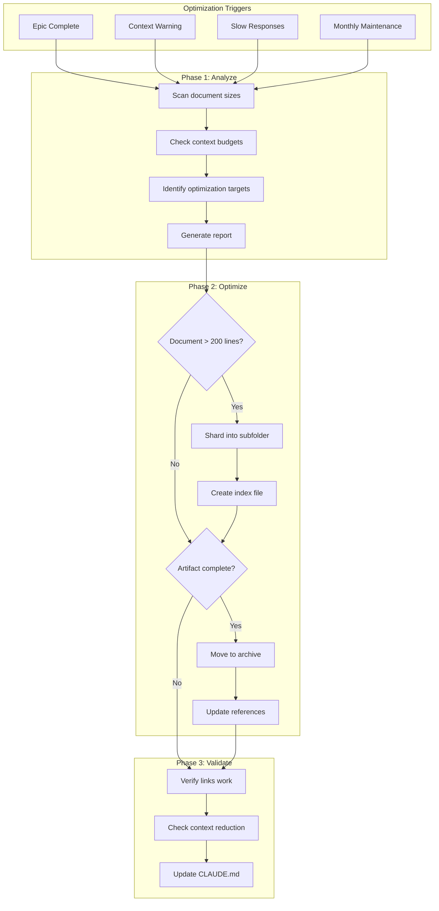
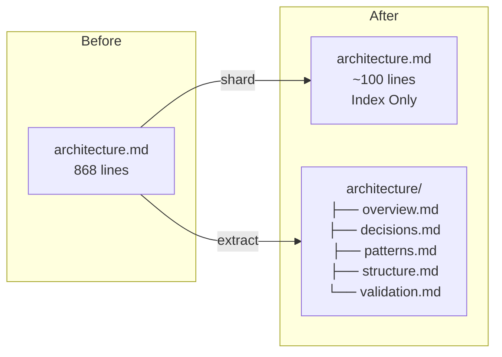
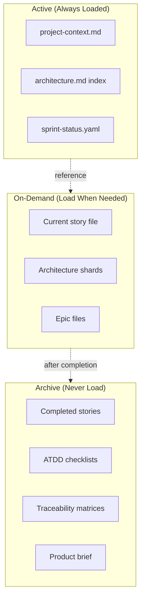
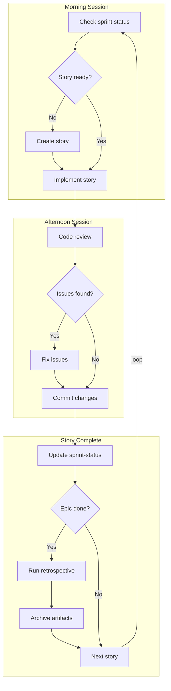
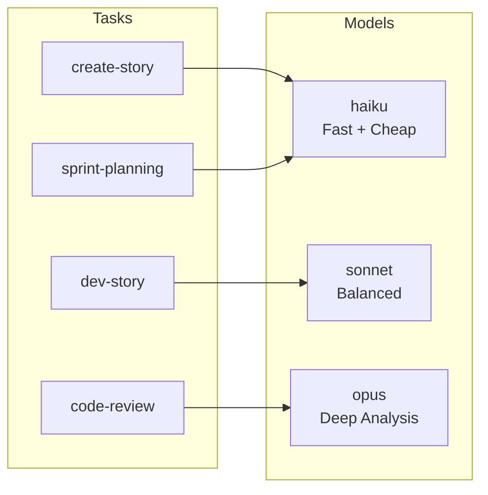
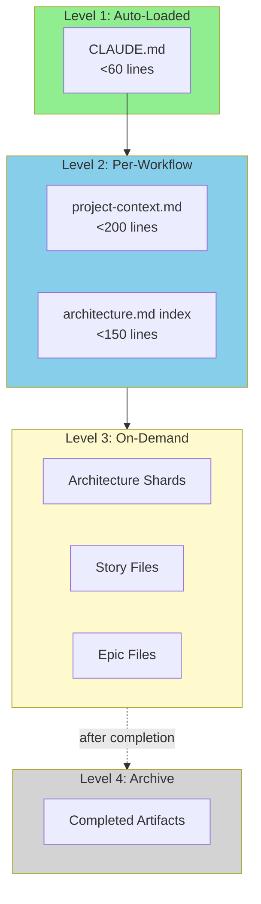
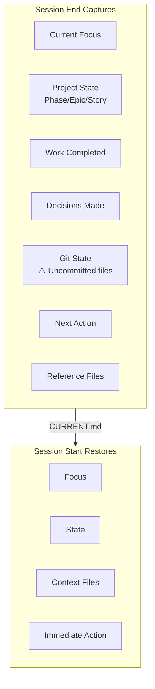

# Development Workflow Guide

**Purpose:** Comprehensive guide for AI-assisted development with context optimization.
**Project:** SubmitSmart
**Last Updated:** 2026-01-24

---

## Table of Contents

1. [Core Principle](#1-core-principle)
2. [Context Optimization Workflow](#2-context-optimization-workflow)
3. [Daily Development Flow](#3-daily-development-flow)
4. [Document Management](#4-document-management)
5. [Session Management](#5-session-management)
6. [Quick Reference](#6-quick-reference)

---

## 1. Core Principle

> **Keep AI context usage under 60% for optimal performance.**

When context grows too large, agents lose focus, make errors, and work slower. This guide provides workflows to maintain lean, efficient context.

### Context Budget Targets

| File | Target | Current | Status |
|------|--------|---------|--------|
| `CLAUDE.md` | <60 lines | ~90 lines | Reduce |
| `project-context.md` | <200 lines | ~227 lines | OK |
| `architecture.md` | <150 lines (index) | 109 lines | ✓ Sharded |
| `CURRENT.md` | <50 lines | ~60 lines | OK |
| Individual stories | <400 lines | - | Monitor |

---

## 2. Context Optimization Workflow

### Workflow Overview



### Optimization Modes

| Mode | Command | Description | Changes Files? |
|------|---------|-------------|----------------|
| `analyze` | `/context-optimize` | Report issues only | No |
| `archive` | `/context-optimize archive` | Move completed artifacts | Yes (moves) |
| `full` | `/context-optimize full` | Archive + shard + update | Yes |

### Step-by-Step: Context Optimization

#### Step 1: Analyze Current State

```bash
# Run analysis to see current context health
/context-optimize
```

**Expected Output:**
```
Context Analysis Report
=======================
CLAUDE.md: 90 lines (target: <60) ⚠️
project-context.md: 213 lines (target: <200) ✓
architecture.md: 868 lines (target: <150) ❌ SHARD RECOMMENDED

Recommendations:
1. Shard architecture.md into subdocuments
2. Reduce CLAUDE.md by removing duplicates
3. Archive completed story files from Epic 1
```

#### Step 2: Shard Large Documents

For documents exceeding 200 lines:



**Sharding Rules:**
- Keep index under 150 lines with essential patterns
- Put shards in subfolder (avoids glob pattern matching)
- Include "When to Load" guidance in index
- Most frequently needed content → `patterns.md`

#### Step 3: Archive Completed Artifacts



**Archive Location:** `_bmad-output/archive/`

| Artifact Type | When to Archive | Location |
|---------------|-----------------|----------|
| Completed stories | After epic done | `archive/epic-{N}-completed/` |
| ATDD checklists | After epic done | `archive/epic-{N}-completed/` |
| Traceability matrices | After epic done | `archive/epic-{N}-completed/` |
| Product brief | After PRD final | `archive/discovery-phase/` |

#### Step 4: Update References

After sharding or archiving:
1. Update `CLAUDE.md` with new locations
2. Verify all internal links work
3. Run `/context-optimize` to confirm improvement

---

## 3. Daily Development Flow

### The Golden Path



### Workflow Commands

| Scenario | Command |
|----------|---------|
| "What should I do next?" | `/bmad:bmm:workflows:sprint-status` |
| "Start implementing" | `/bmad:bmm:workflows:dev-story` |
| "Need to create story file" | `/bmad:bmm:workflows:create-story` |
| "Story is ready for review" | `/bmad:bmm:workflows:code-review` |
| "Epic final story (integration testing)" | `/bmad:bmm:workflows:epic-integration` |
| "Epic is complete" | `/bmad:bmm:workflows:retrospective` |
| "Optimize context" | `/context-optimize` |

### Epic Final Story Protocol

**CRITICAL:** The last story of each epic (`*-integration-and-verification-testing`) uses a dedicated workflow.

**Single Command:**
```bash
/bmad:bmm:workflows:epic-integration
```

**What It Does (automatically):**
1. **Git Setup** - Checkout main, pull latest, create feature branch
2. **TEA Agent** - Load Test Engineering Architect persona
3. **TR Workflow** - Run `testarch-trace` for traceability matrix
4. **TA Workflow** - Run `testarch-automate` for test coverage
5. **Dev-Story** - Implement all story tasks
6. **Validation** - Run lint, build, tests
7. **Git Finish** - Commit and push to remote branch

**Model:** Sonnet

**Why This Workflow?**
- Complete git workflow (branch → implement → push)
- TEA specializes in test architecture and quality assurance
- TR validates all requirements have test coverage
- TA generates comprehensive test suites
- Ensures epic is production-ready before moving forward

### Model Selection Strategy



| Workflow | Model/Agent | Rationale |
|----------|-------------|-----------|
| create-story | haiku | Template filling, cost savings |
| sprint-planning | haiku | Simple extraction |
| dev-story | sonnet | Balanced reasoning (default) |
| **epic-integration** | **sonnet** | TEA + TR + TA + dev-story |
| code-review | opus | Comprehensive analysis |

---

## 4. Document Management

### Document Hierarchy



### Size Targets & Actions

| Document | Target | Current | Status |
|----------|--------|---------|--------|
| CLAUDE.md | <60 lines | ~90 | Reduce |
| project-context.md | <200 lines | ~227 | OK |
| architecture.md (index) | <150 lines | 109 | ✓ Sharded |
| CURRENT.md | <50 lines | ~60 | OK |
| PRD | <500 lines | Check | Reference, don't duplicate |
| Story files | <400 lines | - | Monitor |
| Epic files | <300 lines | - | Monitor |

### Architecture Sharding (Complete ✓)

```
_bmad-output/planning-artifacts/
├── architecture.md                 # Index (109 lines) ✓
│   └── Links to shards
│   └── Critical patterns inline
│   └── "When to load" guidance
│
└── architecture/                   # Shards ✓
    ├── architecture-overview.md    # 68 lines
    ├── architecture-decisions.md   # 230 lines
    ├── architecture-patterns.md    # 193 lines (MOST USED)
    ├── architecture-structure.md   # 216 lines
    └── architecture-validation.md  # 215 lines
```

---

## 5. Session Management

### Why Sessions Matter

After `/clear`, the AI has **no memory** of:
- Previous conversation
- Decisions made
- Current work state

The session workflow preserves quality by capturing critical context.

### Session Lifecycle

```mermaid
flowchart LR
    subgraph Session["Active Session"]
        W[Work on tasks]
        D[Make decisions]
        M[Modify files]
    end

    subgraph End["Session End"]
        E1[Capture git state]
        E2[Gather context]
        E3[Save CURRENT.md]
    end

    subgraph Clear["Context Reset"]
        CL[/clear]
    end

    subgraph Start["Session Start"]
        S1[Load CURRENT.md]
        S2[Check git state]
        S3[Load references]
        S4[Display brief]
    end

    Session --> End
    End --> Clear
    Clear --> Start
    Start --> Session
```

### Session Commands

| Command | Purpose | When to Use |
|---------|---------|-------------|
| `/session-end` | Save state to CURRENT.md | Before `/clear` or ending work |
| `/session-start` | Resume from CURRENT.md | After `/clear` or starting work |
| `/session-start fresh` | Ignore handoff, start clean | When handoff is stale |

### Handoff Location

**File:** `_bmad-output/CURRENT.md`

### What Gets Captured



### Context Recovery Strategy

| Context Level | Action | Command |
|---------------|--------|---------|
| 50-60% | Summarize conversation | `/compact` |
| 70%+ | End session with handover | `/session-end` |
| New session | Resume from handover | `/session-start` |

### Handoff Quality Rules

**Must include:**
- Current focus (what you were working on)
- Active story and task progress
- Key decisions made this session
- Immediate next action (specific!)
- Reference files for next session

**Keep lean:**
- Under 50 lines content
- Reference artifacts, don't duplicate
- Be specific and actionable

### Git State Warning

If uncommitted changes exist at session end:

```
⚠️  UNCOMMITTED CHANGES DETECTED

The following files have uncommitted changes:
- components/onboarding/OnboardingWizard.tsx
- lib/validations/profile.ts

Consider committing before ending session.
```

### Example Handoff

```markdown
# Session Handoff - 2026-01-24 14:30

## Current Focus
Implementing Story 2-1: User onboarding flow

## Project State
- **Phase**: Implementation
- **Epic**: Epic 2 - User Management (in-progress)
- **Story**: 2-1-onboarding-flow (Task 3/5)
- **Last Workflow**: /bmad:bmm:workflows:dev-story

## Session Summary
### Work Completed
- Created OnboardingWizard component
- Implemented step navigation logic

### Decisions Made
- Using multi-step wizard (not single page)
- Storing progress in localStorage

## Git State
⚠️ Uncommitted: OnboardingWizard.tsx, ProfileStep.tsx

## Next Session
### Immediate Action
Implement Task 4: Email verification step

### Reference Files
- Story: _bmad-output/implementation-artifacts/2-1-onboarding-flow.md
- Patterns: _bmad-output/planning-artifacts/architecture/architecture-patterns.md
```

---

## 6. Quick Reference

### Command Cheat Sheet

```
DAILY DEVELOPMENT
─────────────────
/bmad:bmm:workflows:sprint-status    → Check what's next
/bmad:bmm:workflows:create-story     → Create story file
/bmad:bmm:workflows:dev-story        → Implement story
/bmad:bmm:workflows:code-review      → Review code (use opus)

EPIC FINAL STORY (Integration Testing)
──────────────────────────────────────
/bmad:bmm:workflows:epic-integration → TEA + TR + TA + dev-story (all-in-one)

CONTEXT MANAGEMENT
──────────────────
/context-optimize                    → Analyze context health
/context-optimize archive            → Archive completed work
/context-optimize full               → Full optimization

SESSION MANAGEMENT
──────────────────
/session-start                       → Resume from CURRENT.md
/session-start fresh                 → Ignore handoff, start clean
/session-end                         → Save state to CURRENT.md
/session-end "blocker"               → Save with blocker note
/compact                             → Summarize to save context
/clear                               → Fresh start (run /session-end first!)

EPIC COMPLETION
───────────────
/bmad:bmm:workflows:retrospective    → Review epic
/context-optimize archive            → Clean up artifacts
```

### Decision Tree: What Should I Do?

```mermaid
flowchart TB
    Start[Start] --> Q1{New project?}
    Q1 -->|Yes| A1[/bmad:bmm:workflows:sprint-planning]
    Q1 -->|No| Q2{Know current status?}

    Q2 -->|No| A2[/bmad:bmm:workflows:sprint-status]
    Q2 -->|Yes| Q3{Story file exists?}

    Q3 -->|No| A3[/bmad:bmm:workflows:create-story]
    Q3 -->|Yes| Q4{Integration story?}

    Q4 -->|Yes| TEA[/epic-integration<br/>TEA + TR + TA + dev-story]
    Q4 -->|No| Q5{Story implemented?}

    Q5 -->|No| A4[/bmad:bmm:workflows:dev-story]
    Q5 -->|Yes| Q6{Code reviewed?}

    TEA --> Q6
    Q6 -->|No| A5[/bmad:bmm:workflows:code-review]
    Q6 -->|Yes| Q7{Epic complete?}

    Q7 -->|No| A2
    Q7 -->|Yes| A6[/bmad:bmm:workflows:retrospective]

    A6 --> A7[/context-optimize archive]
```

### The Three Pillars

1. **Lean Context Files**
   - CLAUDE.md under 60 lines
   - project-context.md under 200 lines
   - Shard large documents

2. **Aggressive Archiving**
   - Archive after every epic
   - Never load archived files
   - Separate active from completed

3. **Session Discipline**
   - One story per session
   - Use `/compact` at 50% context
   - Different LLM for code review

---

## Appendix: Immediate Actions for SubmitSmart

### Priority 1: Shard Architecture Document

Current `architecture.md` is 868 lines. Recommended sharding:

| Shard | Lines (est.) | Contains |
|-------|--------------|----------|
| `architecture.md` (index) | ~100 | ToC, critical patterns, when-to-load |
| `architecture-overview.md` | ~100 | Context, requirements analysis |
| `architecture-decisions.md` | ~200 | Technology choices, rationale |
| `architecture-patterns.md` | ~200 | Implementation patterns |
| `architecture-structure.md` | ~200 | Directory structure, boundaries |
| `architecture-validation.md` | ~100 | Validation, readiness |

### Priority 2: Trim CLAUDE.md

Current ~90 lines, target <60. Remove:
- Duplicated info from project-context.md
- Verbose explanations (link instead)
- Old/completed status info

### Priority 3: Create Archive Structure

```bash
mkdir -p _bmad-output/archive/{discovery-phase,planning-redundant}
```

---

**Golden Rule:** Keep context under 60%. When in doubt, archive and shard.
