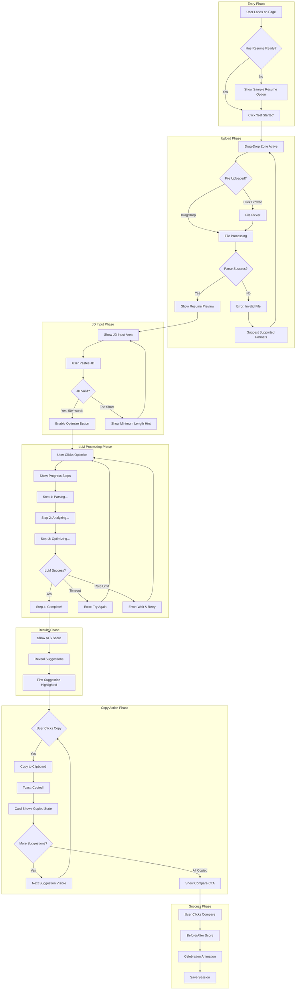
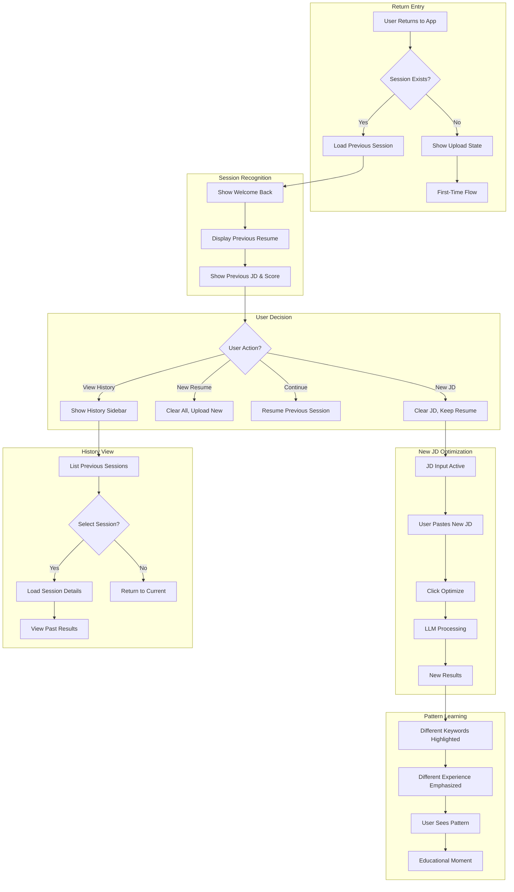
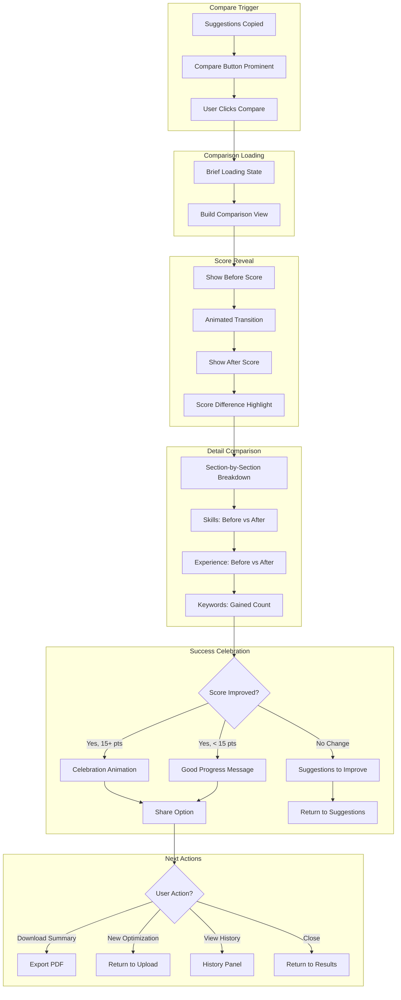

# UX Design Specification - ATS Resume Optimizer (submit_smart)

**Author:** Lawrence
**Date:** 2026-01-24

---

<!-- UX design content will be appended sequentially through collaborative workflow steps -->

## Executive Summary

### Project Vision

ATS Resume Optimizer is an education-first content optimization platform. Unlike resume builders that produce documents, we produce understanding - helping job seekers learn why ATS optimizations work while providing actionable content suggestions they copy-paste into their own resumes.

**Design Philosophy:** Trust through transparency, education through interaction, success through visible improvement.

### Target Users

| Persona | Primary Need | Experience Level | Device |
|---------|--------------|------------------|--------|
| Co-op Students (35%) | Translate academic projects to professional language | First real jobs | Desktop |
| Master's Students (25%) | Convert academic CV to corporate resume | Career transition | Desktop |
| Early Career (25%) | Maximize limited experience impact | 0-3 years | Desktop |
| Mid-Career | Update stale resume, articulate growth | 3-8 years | Desktop |
| Career Changers (15%) | Reframe transferable skills for new industry | Pivoting | Desktop |

**Common Traits:** Anxious about job search, time-pressured, wants to understand (not just apply) suggestions.

### Key Design Challenges

1. **60-Second Wait State** - LLM optimization takes time. Design must make waiting engaging and progress visible.

2. **Information Architecture** - Gap analysis, scores, suggestions, comparisons - complex data requiring clear hierarchy.

3. **Copy-Paste UX** - Intentional friction that must feel rewarding. Each copy action = micro-celebration.

4. **Trust & Professionalism** - Career-critical tool requires Stripe-level polish to inspire confidence.

5. **Score Psychology** - The 38% → 71% moment is the product's emotional peak. Design must amplify it.

### Design Opportunities

1. **Stripe-Inspired Aesthetic** - Clean whites, purple accents, generous whitespace, subtle shadows establish immediate credibility.

2. **Score Gamification** - Point values per suggestion, animated score increases, progress tracking.

3. **Before/After Theater** - Compare feature as a visual transformation story.

4. **Progressive Disclosure** - Summary → Details flow prevents overwhelm.

### Design Direction (from References)

- **Primary Color:** Purple/Indigo (#635BFF) - CTAs, active states, primary actions
- **Accent Colors:** Cyan/Teal (information), Green (success/improvement)
- **Background:** Clean white with light gray sections for hierarchy
- **Typography:** Clean sans-serif, strong hierarchy, generous line-height
- **Components:** Subtle card shadows, clean data tables, left sidebar navigation
- **Style:** Professional dashboard aesthetic with Stripe-level polish

---

## Core User Experience

### Defining Experience

**Core Loop:** Upload Resume → Paste JD → View Score → Copy Suggestions → See Improvement

**Primary Interaction:** The copy-suggestion moment is where value is delivered. Everything else serves this action.

**Time to Value:** First-time users should reach their first copy action within 90 seconds of landing.

### Platform Strategy

| Aspect | Decision |
|--------|----------|
| Primary Platform | Web (Desktop-first SPA) |
| Input Method | Mouse + Keyboard |
| Responsive | Yes, desktop-optimized |
| Offline Support | No (LLM requires connectivity) |
| Key APIs | Clipboard API, Drag-Drop, File API |

**Mobile Strategy:** Responsive but not primary. Mobile users can review results, but primary optimization happens on desktop.

### Effortless Interactions

| Interaction | Effortless Design |
|-------------|-------------------|
| Resume Upload | Drag-drop anywhere on screen, instant text preview |
| JD Input | Paste-and-go, auto-trim, no formatting required |
| Copy Suggestions | One-click copy with instant visual feedback |
| Score Understanding | Visual-first - numbers secondary to visual impact |
| Progress Tracking | Always visible, never hunt for status |

### Critical Success Moments

| Moment | Emotion | Design Response |
|--------|---------|-----------------|
| **Initial Score** | Concern/Curiosity | Dramatic reveal, clear "room to improve" message |
| **See Suggestions** | Hope/Relief | Quality visible immediately, original alongside |
| **First Copy** | Commitment | Toast celebration, score preview update |
| **Score Improvement** | Triumph | Animated increase, before/after comparison |
| **Return Visit** | Recognition | "Welcome back," history visible, personalized |

### Experience Principles

1. **Score is King** - ATS score anchors every screen and decision
2. **Copy = Victory** - Each copy is a celebrated micro-win
3. **Progressive Revelation** - Summary first, details on demand
4. **Trust Through Polish** - Stripe-level quality signals competence
5. **Speed Over Features** - Value in 60 seconds, cut delays ruthlessly

---

## Desired Emotional Response

### Primary Emotional Goals

| Goal | Description |
|------|-------------|
| **Empowered** | Users feel capable and in control of their job search |
| **Confident** | Users can explain their resume changes in interviews |
| **Relieved** | "Finally, a tool that actually helps" |
| **Accomplished** | Score improvement = personal achievement |

**Core Emotional Promise:** "You'll leave feeling more confident about your job search, not more dependent on a tool."

### Emotional Journey Map

| Stage | Starting Emotion | Target Emotion | Design Trigger |
|-------|------------------|----------------|----------------|
| Discovery | Anxious, skeptical | Curious, hopeful | Professional aesthetic, clear value prop |
| Upload | Uncertain | Assured | Instant feedback, clear progress |
| Initial Score | Worried | Motivated | "Room to improve" framing |
| Suggestions | Skeptical | Impressed | Quality visible, logic explained |
| First Copy | Hesitant | Committed | Celebration toast, score preview |
| Score Jump | Hopeful | Triumphant | Animated before/after |
| Completion | Satisfied | Empowered | Learning reinforcement |
| Return | Familiar | Welcomed | Recognition, personalization |

### Micro-Emotions

**Cultivate:**
- Confidence → Show transformation logic, explain changes
- Trust → Polish, transparency, no gimmicks
- Excitement → Gamified scoring, animated improvements
- Ownership → Copy-paste friction, education focus

**Prevent:**
- Confusion → Clear hierarchy, obvious next steps
- Anxiety → Progress indicators, time estimates
- Overwhelm → Progressive disclosure, summary-first
- Dependency → Explain "why", teach patterns

### Emotional Design Principles

1. **Frame Low Scores as Opportunity** - Never "you failed," always "room to grow"
2. **Celebrate Every Copy** - Each action = micro-win with visual feedback
3. **Explain the Magic** - Trust comes from transparency, not mystery
4. **Speed Builds Confidence** - Fast response = competent tool
5. **Polish Signals Quality** - Stripe-level design = Stripe-level suggestions

---

## UX Pattern Analysis & Inspiration

### Inspiring Products

#### Stripe Dashboard (Primary Inspiration)
- **Information Hierarchy:** Whitespace, subtle backgrounds, clear sections
- **Data Presentation:** Cards, tables, status badges, clean charts
- **Navigation:** Persistent sidebar, breadcrumbs, contextual actions
- **Polish Level:** Professional aesthetic that signals competence
- **Trust Signal:** Handles money → trustworthy design language

#### Grammarly (Score-Based Feedback)
- **Real-time Scoring:** Updates as content changes
- **Inline Suggestions:** Context-aware improvements
- **Explanation System:** "Why this helps" on every suggestion

#### Notion (Content Organization)
- **Clean Interface:** Minimal chrome, content-focused
- **Block-based:** Easy to understand discrete sections

### Transferable Patterns

| Pattern | Application |
|---------|-------------|
| Left Sidebar Navigation | Session history, resume library, main nav |
| Summary → Detail Hierarchy | Score overview → Section breakdown → Suggestions |
| Status Badges | Color-coded match indicators |
| Progress Steps | Upload → Analyze → Optimize → Compare |
| One-Click Copy | Copy buttons with visual confirmation |
| Explanation Tooltips | "Why this helps" on hover |
| Empty State Guidance | Clear CTAs when no content |

### Anti-Patterns to Avoid

| Avoid | Why | Instead |
|-------|-----|---------|
| Wall of Text | Overwhelming | Card-based, scannable |
| Hidden Progress | Anxiety | Animated steps, status |
| Modal Overload | Interrupts | Inline, slide-overs |
| Generic AI Output | Distrust | Side-by-side comparison |
| Over-Gamification | Gimmicky | Subtle celebrations |

### Design Inspiration Strategy

**Adopt:** Stripe's sidebar, cards, color system, spacing, polish level
**Adapt:** Grammarly's scoring → Our ATS focus; Notion's blocks → Resume sections
**Avoid:** Dashboard complexity, enterprise feature creep, dark patterns

---

## Design System Foundation

### Design System Choice

**Selected:** shadcn/ui + Tailwind CSS

**Type:** Themeable component library (copy-paste ownership model)

### Rationale

| Factor | shadcn/ui Advantage |
|--------|-------------------|
| Tech Stack Alignment | Already specified in PRD |
| Stripe Aesthetic | Achievable with Tailwind customization |
| Customization | Full code ownership, no vendor lock |
| Accessibility | Radix primitives, WCAG compliant |
| Next.js Compatibility | Native App Router support |
| Speed to Build | Pre-built primitives, fast iteration |

### Implementation Approach

**Layer 1: shadcn/ui Base**
- Pre-built accessible components
- Radix UI primitives underneath
- Copy into project (ownership)

**Layer 2: Tailwind Customization**
- Stripe-inspired color palette
- Custom spacing scale
- Typography system

**Layer 3: Design Tokens**
- CSS variables for theming
- Consistent spacing/sizing
- Color semantic naming

**Layer 4: Custom Components**
- ScoreCircle, SuggestionCard, CopyButton
- Built on shadcn primitives

### Core Components

| Component | Source | Usage |
|-----------|--------|-------|
| Button | shadcn | CTAs, actions |
| Card | shadcn | Content containers |
| Input/Textarea | shadcn | JD input |
| Progress | shadcn | Loading states |
| Toast | shadcn (sonner) | Notifications |
| Tabs | shadcn | Section navigation |
| Badge | shadcn | Status indicators |
| Skeleton | shadcn | Loading placeholders |
| Tooltip | shadcn | Help text |

### Customization Strategy

**Colors (Stripe-Inspired):**
- Primary: #635BFF (Purple/Indigo)
- Success: #10B981 (Green - score improvement)
- Warning: #F59E0B (Yellow - moderate match)
- Danger: #EF4444 (Red - low match)
- Background: White + Gray scale

**Custom Components to Build:**
- ScoreCircle - Animated circular score display
- SuggestionCard - Original/optimized comparison
- CopyButton - One-click with confirmation
- ProgressSteps - Multi-step optimization status
- ScoreChange - Animated before/after

---

## Defining Experience

### The Core Interaction

**Defining Experience:** "Copy the suggestion, see your score jump."

This is our "swipe right" moment - the action users describe to friends. Everything else exists to enable this core loop.

**User Description:** "I just copy the suggestions and my score went from 38% to 71%."

### User Mental Model

**Current Approach:**
- Manual keyword spotting
- Guesswork-based rewriting
- No verification of improvement

**Expected Model:**
- "Grammarly for resumes" - inline suggestions
- "Score = resume quality" - gamified improvement
- "Copy-paste = progress" - discrete satisfying steps

**Confusion Points to Avoid:**
- Generic AI-sounding output
- No verification of impact
- Wall of text overwhelm

### Success Criteria

| Criteria | Target |
|----------|--------|
| Recognition Speed | User sees value in <3 seconds |
| Copy Confidence | User understands "why" before action |
| Impact Visibility | Score change shown immediately |
| Ownership Feeling | User feels they improved it, not AI |

### Pattern Strategy

**Established (Adopt):**
- One-click copy (code editors)
- Before/after comparison (Grammarly)
- Progress indicators (LinkedIn)
- Card-based content (Stripe)

**Novel (Innovate):**
- Score preview on hover (show impact before action)
- Section-by-section reveal (reduce overwhelm)

### Experience Mechanics

**Initiation → Interaction → Feedback → Completion**

1. **Initiation:** Results appear, highest-impact suggestion highlighted
2. **Interaction:** Side-by-side view, one-click copy, point impact visible
3. **Feedback:** Toast confirms, score preview updates, card marks complete
4. **Completion:** Compare CTA, final score celebration

---

## Visual Design Foundation

### Color System

**Primary Palette:**
| Token | Hex | Usage |
|-------|-----|-------|
| primary | #635BFF | CTAs, active states |
| primary-hover | #5851DB | Hover states |
| primary-light | #F5F3FF | Subtle backgrounds |

**Semantic Colors:**
| Token | Hex | Usage |
|-------|-----|-------|
| success | #10B981 | Score improvements |
| warning | #F59E0B | Moderate match |
| danger | #EF4444 | Low match, errors |

**Neutrals:**
| Token | Hex | Usage |
|-------|-----|-------|
| gray-900 | #111827 | Primary text |
| gray-500 | #6B7280 | Muted text |
| gray-100 | #F3F4F6 | Backgrounds |
| white | #FFFFFF | Cards |

### Typography System

**Font:** Inter (sans-serif), JetBrains Mono (code)

**Scale:**
| Level | Size | Weight |
|-------|------|--------|
| h1 | 30px | 600 |
| h2 | 24px | 600 |
| h3 | 20px | 600 |
| body | 16px | 400 |
| small | 14px | 400 |

### Spacing System

**Base Unit:** 4px

**Scale:** 4, 8, 12, 16, 24, 32, 48, 64px

**Layout:**
- Max width: 1280px
- Sidebar: 240px
- Gutter: 24px

### Effects

**Border Radius:** 4px (small), 8px (medium), 12px (large)

**Shadows:** Subtle (cards), Medium (modals)

### Accessibility

- WCAG AA contrast compliance
- Minimum 44px touch targets
- Visible focus indicators
- Minimum 14px body text

---

## Design Direction

### Chosen Direction

**Direction:** Stripe-Inspired Dashboard with Optimization Focus

**Layout Pattern:**
- Fixed left sidebar (240px) for navigation and section switching
- Main content area for results and interactions
- Top navigation for primary modes (New/Results/History)

### Key Design Elements

#### Score Visualization
- Large circular score display with animated fill
- Color transitions: Red (<40%) → Yellow (40-70%) → Green (>70%)
- Prominent placement - anchors all optimization screens
- Before/after comparison in Compare view

#### Suggestion Cards
- Two-column layout: Original (left) vs Optimized (right)
- Point value badge showing impact (+8 pts)
- One-click copy button with visual confirmation
- "Why this helps" expandable explanation
- Copied state indication (checkmark, muted style)

#### Progress States
- 4-step progress indicator: Upload → Analyze → Optimize → Results
- Active step highlighted with purple
- Completed steps show checkmark
- Time estimate for LLM processing (analyzing step)

#### Empty/Upload States
- Generous drag-drop zone with dashed border
- Animated upload icon on hover/drag
- Clear file type indicators (PDF, DOCX, TXT)
- Sample resume option for first-time users

### Design Artifacts

**HTML Prototype:** `_bmad-output/planning-artifacts/ux-design-directions.html`

The prototype includes 4 interactive views:
1. **Results View** - Main optimization results with score and suggestion cards
2. **Upload View** - Drag-drop interface for resume upload
3. **Loading State** - Progress steps during LLM analysis
4. **Compare View** - Before/after score celebration

---

## User Journey Flows

### First-Time Optimization Flow (Primary Path)

**Journey:** Anonymous user optimizes their first resume (Maya's story)

**Entry Point:** Landing page, organic search, or referral link

**Success Outcome:** User copies at least one suggestion and sees score improvement

**Flow Optimizations:**
- **Time to Value:** < 90 seconds from landing to first copy action
- **Zero Friction Entry:** Anonymous auth, no signup required for V0.1
- **Progress Visibility:** 4-step indicator reduces anxiety during 60-second wait
- **Error Recovery:** Clear messages with retry actions, never dead-ends

---

### Returning User Flow (Session Continuity)

**Journey:** User returns to optimize different JD with same resume (Marcus's story)

**Entry Point:** Direct URL or bookmark

**Success Outcome:** User sees previous session, optimizes new JD faster

**Flow Optimizations:**
- **Instant Recognition:** Previous session loaded automatically
- **Smart Defaults:** Keep resume, clear JD for new optimization
- **Pattern Teaching:** Highlight what changed between optimizations
- **History Access:** One-click access to past sessions (V1.0)

---

### Compare & Celebrate Flow (Success Moment)

**Journey:** User completes optimization and sees transformation (David's climax)

**Entry Point:** Click "Compare" after copying suggestions

**Success Outcome:** User sees before/after and feels accomplished

**Flow Optimizations:**
- **Dramatic Reveal:** Animated score transition builds anticipation
- **Quantified Impact:** Show exact point gain and keyword count
- **Tiered Celebration:** Different responses for different improvement levels
- **Clear Next Steps:** Never leave user wondering "what now?"

---

### Journey Patterns

**Navigation Patterns:**

| Pattern | Description | Usage |
|---------|-------------|-------|
| Progressive Steps | 4-step indicator (Upload → Analyze → Optimize → Results) | Processing state |
| Sidebar History | Slide-out panel for session history | V1.0 returning users |
| Inline Edit | Stay in context, no modal interruption | JD input, suggestions |

**Decision Patterns:**

| Pattern | Description | Usage |
|---------|-------------|-------|
| Smart Defaults | Pre-select most common option | Keep resume on return |
| Explicit Confirmation | Require click for destructive actions | Clear session |
| Undo Support | Allow reverting recent actions | V1.5+ |

**Feedback Patterns:**

| Pattern | Description | Usage |
|---------|-------------|-------|
| Toast Notifications | Brief, dismissible success messages | Copy confirmation |
| State Transitions | Visual change on interaction | Card → Copied state |
| Progress Animation | Movement during wait states | LLM processing |
| Celebration Moments | Animated success indicators | Score improvement |

---

### Flow Optimization Principles

1. **Minimize Steps to Value**
   - First-time users: 3 actions to first suggestion (upload, paste, click)
   - Returning users: 1 action to new optimization (paste new JD)

2. **Reduce Cognitive Load**
   - One primary CTA per screen state
   - Progressive disclosure: summary → details on demand
   - Visual hierarchy guides attention

3. **Provide Clear Feedback**
   - Every action produces visible response within 100ms
   - Long operations show progress indicators
   - Errors include recovery actions

4. **Create Delight Moments**
   - Score reveal animation
   - Copy confirmation toast
   - Before/after comparison celebration

5. **Handle Errors Gracefully**
   - No dead-ends: always provide next action
   - Specific error messages with suggestions
   - Retry options for transient failures

---

## Component Strategy

### Design System Components

**shadcn/ui provides these foundation components:**

| Component | Usage in ATS Optimizer |
|-----------|----------------------|
| Button | Primary CTAs (Optimize, Copy, Compare) |
| Card | Container for suggestions, sections |
| Input | Text fields (if needed) |
| Textarea | JD paste input area |
| Progress | Loading bar states |
| Badge | Status indicators, point values |
| Toast (Sonner) | Copy confirmations, notifications |
| Tabs | Section navigation in results |
| Skeleton | Loading placeholders |
| Tooltip | Help text, explanations |
| Dialog | Confirmations (V1.0) |
| DropdownMenu | Actions menu (V1.0) |

**Coverage Assessment:** shadcn/ui covers ~70% of component needs. Custom components required for core differentiating features.

---

### Custom Components

#### ScoreCircle

**Purpose:** Display ATS match score as a prominent, animated circular visualization

**Usage:** Results view header, Compare view before/after

**Anatomy:**
- Outer ring (background track)
- Progress arc (colored by score range)
- Center score text (percentage)
- Label text below (optional)

**States:**

| State | Description |
|-------|-------------|
| Loading | Animated spinner, no score |
| Revealed | Score animates from 0 to value |
| Static | Score displayed, no animation |
| Comparing | Two scores side-by-side |

**Variants:**

| Size | Dimensions | Usage |
|------|------------|-------|
| Large | 160px | Primary results display |
| Medium | 100px | Compare view, sidebar |
| Small | 48px | History list items |

**Color Ranges:**
- 0-39%: `danger` (#EF4444)
- 40-69%: `warning` (#F59E0B)
- 70-100%: `success` (#10B981)

**Accessibility:**
- `role="progressbar"` with `aria-valuenow`, `aria-valuemin`, `aria-valuemax`
- Screen reader: "ATS match score: 71 percent"

---

#### SuggestionCard

**Purpose:** Display original content alongside optimized suggestion with copy action

**Usage:** Results view, main optimization output

**Anatomy:**
- Card container
- Section label (Experience, Skills, etc.)
- Point impact badge (+8 pts)
- Two-column content: Original | Optimized
- Copy button (right side)
- "Why this helps" expandable section
- Copied indicator (checkmark)

**States:**

| State | Description |
|-------|-------------|
| Default | Ready for interaction |
| Hover | Subtle highlight, copy button prominent |
| Copying | Brief loading state |
| Copied | Checkmark, muted appearance, "Copied" label |
| Expanded | "Why this helps" visible |

**Variants:**

| Variant | Description |
|---------|-------------|
| Standard | Two-column comparison |
| Compact | Single column, toggle view (mobile) |
| Skills | Grid format for skills suggestions |

**Accessibility:**
- Focusable card with keyboard navigation
- Copy button: `aria-label="Copy optimized suggestion to clipboard"`
- Copied state announced to screen readers
- Expandable section uses `aria-expanded`

**Content Guidelines:**
- Original text: Gray, slightly muted
- Optimized text: Normal weight, primary color highlights on key terms
- Point badge: Always visible, uses semantic color

---

#### CopyButton

**Purpose:** One-click copy to clipboard with visual confirmation

**Usage:** SuggestionCard, standalone copy actions

**Anatomy:**
- Button container
- Icon (clipboard or checkmark)
- Label text (optional)

**States:**

| State | Description |
|-------|-------------|
| Default | Clipboard icon, "Copy" label |
| Hover | Primary color highlight |
| Active | Pressed state |
| Copying | Brief spinner (100ms) |
| Copied | Checkmark icon, "Copied!" label, success color |
| Reset | Returns to default after 2 seconds |

**Variants:**

| Variant | Description |
|---------|-------------|
| Icon-only | Just clipboard icon (compact) |
| With Label | Icon + "Copy" text |
| Prominent | Filled button style for primary CTAs |

**Interaction Behavior:**
1. Click → Copy text to clipboard
2. Show "Copied!" state with checkmark
3. Trigger toast notification
4. Reset to default after 2 seconds
5. If already copied, show "Copy again"

**Accessibility:**
- `aria-label="Copy to clipboard"` (icon-only)
- `aria-live="polite"` for state changes
- Keyboard: Enter/Space to activate

---

#### ProgressSteps

**Purpose:** Show multi-step progress during LLM optimization

**Usage:** Loading state, processing indicator

**Anatomy:**
- Step indicators (circles or icons)
- Step labels
- Progress connector line
- Time estimate (optional)
- Current step highlight

**Steps:**
1. Upload (checkmark when complete)
2. Analyzing (active during LLM parse)
3. Optimizing (active during LLM generation)
4. Complete (success state)

**States:**

| State | Description |
|-------|-------------|
| Pending | Gray, unfilled |
| Active | Primary color, animated pulse |
| Complete | Success color, checkmark |
| Error | Danger color, X icon |

**Variants:**

| Variant | Description |
|---------|-------------|
| Horizontal | Steps in a row (default) |
| Vertical | Steps stacked (mobile/sidebar) |
| Compact | Icons only, no labels |

**Accessibility:**
- `role="progressbar"` with step count
- `aria-label="Step 2 of 4: Analyzing resume"`
- Live region announces step changes

---

#### ScoreChange

**Purpose:** Animated before/after score comparison with celebration

**Usage:** Compare view, success moment

**Anatomy:**
- Before score (ScoreCircle, muted)
- Arrow indicator
- After score (ScoreCircle, prominent)
- Change badge (+33 pts)
- Celebration animation (confetti/sparkles)

**States:**

| State | Description |
|-------|-------------|
| Loading | Skeleton placeholders |
| Revealing | Before score visible, after animating |
| Complete | Both scores, change badge visible |
| Celebrating | Animation plays (15+ pt improvement) |

**Animation Sequence:**
1. Show "Before" score (0.5s)
2. Pause (0.3s)
3. Animate arrow (0.3s)
4. Count up "After" score (1s)
5. Show change badge (0.2s)
6. Play celebration if 15+ pts (1s)

**Accessibility:**
- Animation respects `prefers-reduced-motion`
- Screen reader: "Score improved from 38 percent to 71 percent, an increase of 33 points"

---

### Component Implementation Strategy

**Build Approach:**

| Principle | Implementation |
|-----------|----------------|
| Use design system tokens | All colors, spacing, typography from Tailwind config |
| Compose from primitives | Build on shadcn Card, Button, Badge |
| Accessible by default | ARIA labels, keyboard nav, screen reader support |
| Animation-ready | Framer Motion for smooth transitions |
| Responsive | Mobile-first, desktop-optimized |

**Technology Stack:**

| Concern | Technology |
|---------|------------|
| Component Framework | React + TypeScript |
| Styling | Tailwind CSS + CSS Variables |
| Animation | Framer Motion |
| Icons | Lucide React |
| Clipboard | navigator.clipboard API |
| State | React hooks (useState, useEffect) |

---

### Implementation Roadmap

**Phase 1 - Core Components (V0.1)**

| Component | Priority | Reason |
|-----------|----------|--------|
| ScoreCircle | P0 | Core value visualization |
| SuggestionCard | P0 | Primary output display |
| CopyButton | P0 | Core action mechanism |
| ProgressSteps | P0 | Processing state feedback |

**Phase 2 - Enhancement Components (V1.0)**

| Component | Priority | Reason |
|-----------|----------|--------|
| ScoreChange | P1 | Compare feature success moment |
| HistoryCard | P1 | Session history display |
| ResumePreview | P1 | Resume content preview |

**Phase 3 - Polish Components (V1.5+)**

| Component | Priority | Reason |
|-----------|----------|--------|
| OnboardingSteps | P2 | User onboarding flow |
| SettingsPanel | P2 | Configuration options |
| ExportButton | P2 | PDF/summary export |

---

## UX Consistency Patterns

### Button Hierarchy

**Primary Actions (Purple filled)**

| Usage | Label | Style |
|-------|-------|-------|
| Main CTA | "Optimize Resume" | `bg-primary text-white` |
| Confirm action | "Compare Results" | `bg-primary text-white` |
| Submit | "Save" | `bg-primary text-white` |

**Behavior:**
- One primary button per screen state
- Always indicates the "what to do next" action
- Hover: darken 10%, slight scale (1.02)
- Active: darken 15%, scale down (0.98)
- Disabled: 50% opacity, no cursor

**Secondary Actions (Purple outline)**

| Usage | Label | Style |
|-------|-------|-------|
| Alternative option | "Start Over" | `border-primary text-primary` |
| Cancel | "Cancel" | `border-primary text-primary` |
| View more | "View All" | `border-primary text-primary` |

**Behavior:**
- Used alongside primary when multiple options exist
- Hover: light purple background fill
- Never more prominent than primary

**Tertiary Actions (Text only)**

| Usage | Label | Style |
|-------|-------|-------|
| Navigation | "Back" | `text-gray-500` |
| Help | "Learn more" | `text-gray-500 underline` |
| Dismiss | "Skip" | `text-gray-500` |

**Behavior:**
- Minimal visual weight
- Hover: underline or color change
- Used for non-critical actions

**Icon Buttons**

| Usage | Icon | Style |
|-------|------|-------|
| Copy | Clipboard → Check | `text-gray-500 hover:text-primary` |
| Expand | ChevronDown | `text-gray-500` |
| Close | X | `text-gray-500 hover:text-gray-700` |
| Help | HelpCircle | `text-gray-400` |

---

### Feedback Patterns

#### Success Feedback

**Toast Notifications:**
- Position: Bottom-center, 24px from edge
- Duration: 3 seconds (auto-dismiss)
- Style: White bg, green left border, checkmark icon
- Animation: Slide up, fade in

**Usage Examples:**

| Action | Message | Icon |
|--------|---------|------|
| Copy suggestion | "Copied to clipboard!" | ✓ Checkmark |
| Save session | "Session saved" | ✓ Checkmark |
| Complete optimization | "Optimization complete" | ✓ Checkmark |

**Inline Success:**
- Green checkmark appears next to completed items
- Copied cards show muted state + "Copied" badge
- Score improvements show green delta badge (+15 pts)

#### Error Feedback

**Error Messages:**
- Position: Inline, near the error source
- Style: Red text, danger icon, clear explanation
- Include: What went wrong + How to fix it

**Error Types:**

| Error | Message | Recovery |
|-------|---------|----------|
| File parse failed | "Unable to read this file. Please try PDF or DOCX format." | Show file picker |
| LLM timeout | "Analysis taking longer than expected. Please try again." | Show retry button |
| Rate limit | "You've reached the limit. Please wait 30 seconds." | Show countdown |
| Network error | "Connection lost. Check your internet and try again." | Show retry button |

**Toast Errors:**
- Position: Bottom-center
- Duration: 5 seconds (user dismiss available)
- Style: White bg, red left border, alert icon

#### Warning Feedback

**Warning States:**
- Style: Yellow/amber background, warning icon
- Use for: Non-blocking issues, suggestions

**Examples:**

| Situation | Message |
|-----------|---------|
| Short JD | "Job description seems short. Add more details for better results." |
| Low score | "Room for improvement! Review the suggestions below." |
| Session expiring | "Your session will expire in 5 minutes." |

#### Info Feedback

**Informational States:**
- Style: Blue/cyan background, info icon
- Use for: Tips, educational content, neutral status

**Examples:**

| Situation | Message |
|-----------|---------|
| Processing | "Analyzing your resume against the job description..." |
| First time | "Tip: Copy suggestions one at a time into your resume." |
| Explanation | "Keywords are terms that ATS systems scan for." |

---

### Loading States

#### Full Page Loading

**When:** Initial app load, major navigation

**Pattern:**
- Centered spinner with app logo
- No skeleton (brief load expected)
- Duration: < 2 seconds typical

#### Processing State (LLM Wait)

**When:** 60-second optimization processing

**Pattern:**
- ProgressSteps component (4 steps)
- Current step highlighted with pulse animation
- Time estimate shown: "Usually takes 30-60 seconds"
- Cancel option available
- Engaging copy: "Analyzing keywords...", "Generating suggestions..."

**Stages:**
1. "Parsing your resume..." (5-10s)
2. "Analyzing job requirements..." (10-20s)
3. "Generating optimized content..." (20-40s)
4. "Finalizing suggestions..." (5-10s)

#### Skeleton Loading

**When:** Content loading within loaded page

**Pattern:**
- Animated pulse on gray rectangles
- Match approximate content shape
- Duration: < 1 second typical

**Usage:**
- Suggestion cards before content loads
- Score circle before value calculated
- History items before data fetched

#### Button Loading

**When:** Action in progress

**Pattern:**
- Spinner replaces icon/text
- Button disabled during loading
- Maintain button width (no layout shift)

---

### Empty States

#### No Resume Uploaded

**Visual:** Large drag-drop zone with upload icon

**Copy:**
- Headline: "Upload your resume to get started"
- Subtext: "Drag and drop PDF or DOCX, or click to browse"
- CTA: "Try with sample resume" (secondary)

**Behavior:**
- Entire zone is clickable
- Drag hover shows active state (dashed border becomes solid)

#### No Job Description

**Visual:** Prominent textarea with placeholder

**Copy:**
- Placeholder: "Paste the job description here..."
- Helper: "Copy the full job posting including requirements and qualifications"

**Behavior:**
- Auto-focus when resume uploaded
- Character count shows (min 50 words suggested)

#### No Results Yet

**Visual:** Illustrated placeholder

**Copy:**
- Headline: "Ready to optimize"
- Subtext: "Click 'Optimize Resume' to see your ATS score and suggestions"

#### No History (V1.0)

**Visual:** Simple illustration

**Copy:**
- Headline: "No optimization history yet"
- Subtext: "Your past optimizations will appear here"
- CTA: "Start your first optimization"

---

### Form Patterns

#### Text Input

**States:**

| State | Style |
|-------|-------|
| Default | Gray border, white bg |
| Focus | Primary border, subtle shadow |
| Error | Red border, error message below |
| Disabled | Gray bg, reduced opacity |

**Validation:**
- Real-time validation on blur
- Error messages appear below input
- Success checkmark for valid inputs

#### Textarea (JD Input)

**Specific Patterns:**
- Auto-expand up to max height (300px)
- Character/word count in corner
- Paste detection: auto-trim whitespace
- Minimum content validation (50 words)

**States:**

| State | Indicator |
|-------|-----------|
| Empty | Placeholder visible |
| Has content | Word count shown |
| Too short | Warning message |
| Valid | Green checkmark, ready to optimize |

#### File Upload

**Drag-Drop Zone:**
- Dashed border default
- Solid border + bg change on drag over
- Accepted formats shown: PDF, DOCX, TXT
- Max size: 5MB (show if exceeded)

**Upload Progress:**
- Brief progress bar for large files
- Instant preview for small files
- Error state if parse fails

---

### Navigation Patterns

#### Primary Navigation

**Pattern:** Fixed left sidebar (240px)

**Contents:**
- Logo/brand at top
- New Optimization (primary action)
- Current session info
- History (V1.0)
- Settings (V1.0)
- Help/feedback link

**Behavior:**
- Always visible on desktop
- Collapsible on tablet (hamburger)
- Bottom nav on mobile

#### Section Navigation

**Pattern:** Tabs within results view

**Sections:**
- Overview (score + summary)
- Experience
- Skills
- Education (if applicable)

**Behavior:**
- Horizontal tabs below score
- Badge shows suggestion count per section
- Active tab: primary color underline

---

### Copy Interaction Pattern

**The Core UX Pattern - defined comprehensively:**

#### Trigger
- User clicks Copy button on SuggestionCard
- Keyboard: Enter/Space when button focused

#### Immediate Response (< 100ms)
1. Button icon changes: Clipboard → Spinner
2. Button disabled momentarily

#### Copy Action (100-200ms)
1. Text copied to system clipboard
2. Button icon changes: Spinner → Checkmark
3. Button label: "Copy" → "Copied!"
4. Button color: Default → Success green

#### Feedback (200ms - 3s)
1. Toast appears: "Copied to clipboard!"
2. Card visual change: Slight mute/fade
3. "Copied" badge appears on card

#### State Persistence
1. Card remains in "copied" state for session
2. Checkmark persists on card
3. Button label shows "Copy again" on hover

#### Reset (after 2s)
1. Button returns to default state
2. Card retains "copied" indicator
3. User can copy again if needed

#### Accessibility
- Screen reader: "Copied. Suggestion for Experience section copied to clipboard."
- Focus remains on button after copy
- Keyboard users can Tab to next suggestion

---

## Responsive Design & Accessibility

### Responsive Strategy

**Platform Priority:** Desktop-first (primary use case is resume optimization at desk)

#### Desktop Strategy (Primary)

| Aspect | Approach |
|--------|----------|
| Layout | Fixed sidebar (240px) + fluid main content |
| Content Density | Full detail - all suggestions visible |
| Navigation | Persistent left sidebar |
| Special Features | Side-by-side comparisons, full score visualization |

**Desktop-Specific Enhancements:**
- Two-column suggestion cards (original | optimized)
- Expanded "Why this helps" visible by default
- Full history panel in sidebar
- Keyboard shortcuts for power users

#### Tablet Strategy (Secondary)

| Aspect | Approach |
|--------|----------|
| Layout | Collapsible sidebar, single-column content |
| Content Density | Slightly reduced, progressive disclosure |
| Navigation | Hamburger menu, swipe gestures |
| Touch Targets | Minimum 44px, increased spacing |

**Tablet-Specific Adaptations:**
- Sidebar collapses to hamburger icon
- Suggestion cards stack vertically
- Copy button enlarged for touch
- Swipe between suggestion sections

#### Mobile Strategy (Tertiary)

| Aspect | Approach |
|--------|----------|
| Layout | Single column, bottom navigation |
| Content Density | Summary-first, tap to expand |
| Navigation | Bottom tab bar (3-4 items) |
| Primary Use | Review results, quick copies |

**Mobile-Specific Adaptations:**
- Full-width cards
- Score circle prominent at top
- Simplified progress indicator
- Native share sheet for copy
- Optimized for reviewing, not initial optimization

**Mobile Limitations (Acceptable):**
- Recommend desktop for initial upload/optimization
- JD paste may be cumbersome on mobile
- Full compare feature limited to portrait orientation

---

### Breakpoint Strategy

**Approach:** Desktop-first with graceful degradation

| Breakpoint | Range | Layout |
|------------|-------|--------|
| Desktop XL | ≥1280px | Full layout, max-width container |
| Desktop | 1024px - 1279px | Full layout, fluid |
| Tablet | 768px - 1023px | Collapsed sidebar, single column |
| Mobile | 320px - 767px | Bottom nav, stacked cards |

**Critical Breakpoint Behaviors:**

| Element | Desktop | Tablet | Mobile |
|---------|---------|--------|--------|
| Sidebar | Visible | Hamburger | Hidden |
| Score Circle | Large (160px) | Medium (120px) | Medium (100px) |
| Suggestion Cards | Side-by-side | Stacked | Stacked |
| Copy Button | Icon + Label | Icon + Label | Icon only |
| Navigation | Sidebar | Top hamburger | Bottom tabs |

---

### Accessibility Strategy

**Compliance Level:** WCAG 2.1 Level AA

**Rationale:** Career-critical tool used by diverse job seekers including those with disabilities. AA compliance ensures broad accessibility without excessive complexity.

#### Color & Contrast

| Requirement | Standard | Implementation |
|-------------|----------|----------------|
| Normal text | 4.5:1 ratio | Gray-900 on white = 16:1 ✓ |
| Large text | 3:1 ratio | All headings pass ✓ |
| UI components | 3:1 ratio | Primary purple on white = 4.6:1 ✓ |
| Non-text content | 3:1 ratio | Icons, borders verified |

**Color-Blind Considerations:**
- Never rely on color alone for information
- Score status: Color + icon + text label
- Copied state: Color + checkmark + "Copied" text
- Errors: Red + icon + descriptive text

#### Keyboard Navigation

**Full Keyboard Support:**

| Key | Action |
|-----|--------|
| Tab | Move focus forward |
| Shift+Tab | Move focus backward |
| Enter/Space | Activate buttons, copy |
| Escape | Close modals, cancel |
| Arrow keys | Navigate within components |

**Focus Management:**
- Visible focus ring (2px primary color outline)
- Focus trapped in modals
- Focus returns to trigger after modal close
- Skip link to main content

#### Screen Reader Support

**Semantic Structure:**
- Proper heading hierarchy (h1 → h2 → h3)
- Landmark regions (main, nav, aside)
- Descriptive link text (not "click here")

**ARIA Implementation:**

| Component | ARIA |
|-----------|------|
| Score Circle | `role="progressbar"` with value attributes |
| Copy Button | `aria-label`, `aria-live` for state changes |
| Suggestions | `role="region"` with `aria-label` |
| Toasts | `role="status"` with `aria-live="polite"` |
| Modals | `role="dialog"` with `aria-modal="true"` |

**Screen Reader Announcements:**
- "ATS match score: 71 percent"
- "Copied. Suggestion for Experience section."
- "Step 2 of 4: Analyzing job requirements"
- "Optimization complete. 8 suggestions available."

#### Touch & Motor

| Requirement | Standard | Implementation |
|-------------|----------|----------------|
| Touch targets | 44x44px minimum | All buttons ≥ 44px |
| Spacing | 8px minimum between targets | 12px gap default |
| Gesture alternatives | Single tap fallbacks | No drag-only actions |

---

### Testing Strategy

#### Automated Testing

| Tool | Purpose |
|------|---------|
| axe-core | Automated WCAG testing in CI |
| Lighthouse | Performance + accessibility audits |
| eslint-plugin-jsx-a11y | Catch issues during development |

**CI Integration:**
- Run axe-core on every PR
- Block merge if accessibility violations found
- Lighthouse score threshold: 90+ accessibility

#### Manual Testing

**Screen Reader Testing:**

| Platform | Screen Reader | Priority |
|----------|---------------|----------|
| macOS | VoiceOver | P0 |
| Windows | NVDA | P0 |
| iOS | VoiceOver | P2 |
| Android | TalkBack | P2 |

**Device Testing Matrix:**

| Device | Browser | Priority |
|--------|---------|----------|
| MacBook | Chrome, Safari | P0 |
| Windows | Chrome, Edge | P0 |
| iPad | Safari | P1 |
| iPhone | Safari | P2 |

---

### Implementation Guidelines

#### Responsive Development

- Use Tailwind responsive prefixes: `sm:`, `md:`, `lg:`, `xl:`
- Use CSS Grid for page layout, Flexbox for components
- Test at all breakpoints before merge
- No horizontal scroll at any breakpoint
- Use relative units (rem, %) over fixed pixels

#### Accessibility Development

- All interactive elements must be focusable
- All images must have alt text
- All form inputs must have labels
- All buttons must have accessible names
- All dynamic content must announce changes

**Testing Checklist for Every PR:**
- [ ] Keyboard navigation works
- [ ] Focus indicators visible
- [ ] Color contrast passes
- [ ] Screen reader tested
- [ ] Touch targets adequate
- [ ] No accessibility violations in axe
